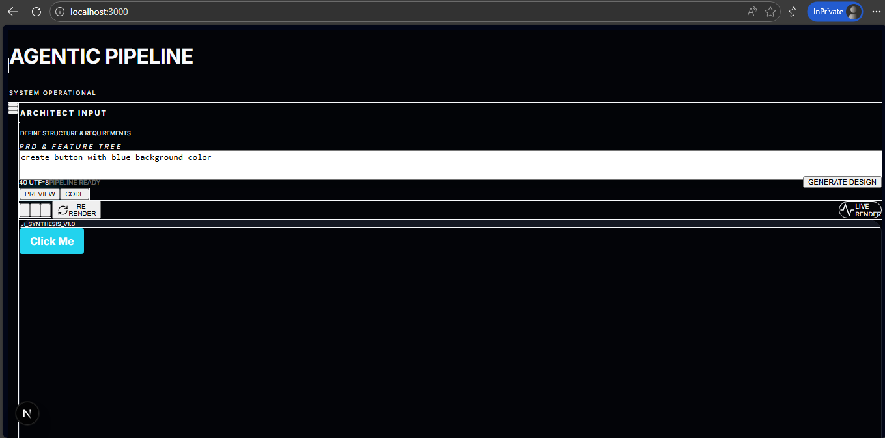
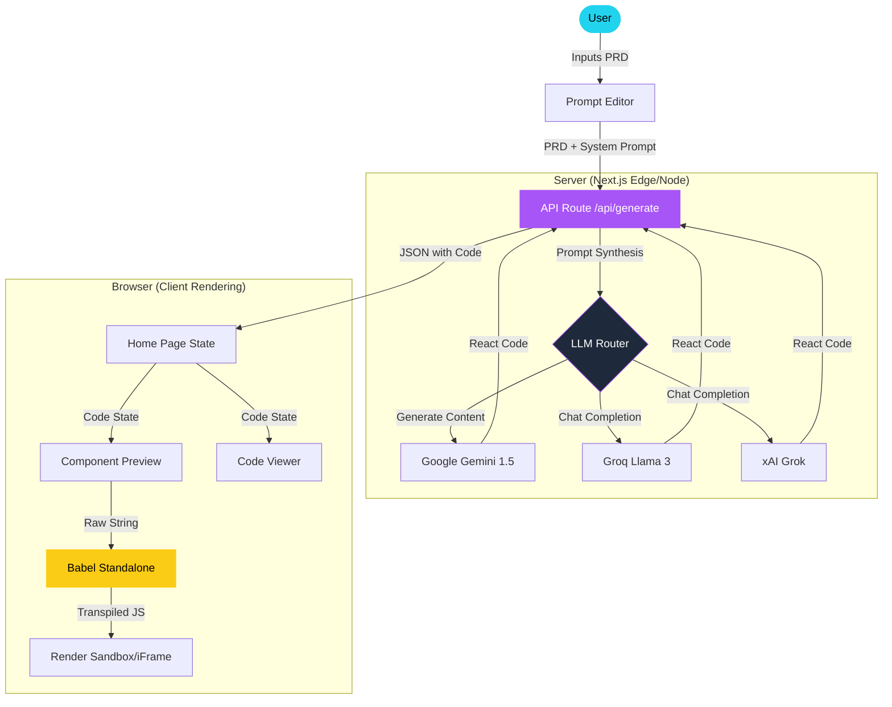

# 🌌 UI Generator

A high-performance, distraction-free dashboard for generating premium React components using an AI-driven agentic pipeline. Describe your requirements (PRD), and watch as the system synthesizes, transpiles, and renders your UI in real-time.

<video src="SpecToUIAgent.mp4" width="100%" controls muted autoplay loop></video>



---

## ✨ Features

- **🚀 Real-time Synthesis**: Live transpilation using Babel-standalone for immediate visual feedback.
- **💎 Premium Aesthetics**: Built-in design system supporting "Dark Glassmorphism" and sleek animations.
- **🤖 Multi-Model Pipeline**: Support for Google Gemini 1.5, Groq (Llama 3), and xAI (Grok).
- **📝 PRD-Driven**: Focused on structured requirements rather than simple prompts.
- **💾 Design History**: Local persistence for your generation history and design iterations.
- **🛠 Code Transparency**: Toggle between live preview and raw source code with one click.

---

## 🏗 Architecture

The system utilizes a split-execution pipeline where prompt synthesis happens on the server, while transpilation and rendering occur entirely in the browser for maximum responsiveness.



---

## 🛠 Tech Stack

| Layer | Technologies |
| :--- | :--- |
| **Frontend** | React, Next.js 15, Tailwind CSS |
| **Runtime** | Babel Standalone (In-browser Transpilation) |
| **Styling** | Vanilla CSS, Framer Motion (Animations) |
| **AI Models** | Google Gemini 1.5 Flash, Llama 3.3 (via Groq), Grok Beta (via xAI) |

---

## 🚀 Getting Started

### 1. Prerequisite: API Keys
Create a `.env.local` file in the root directory and add one of the following:

```env
NEXT_PUBLIC_GEMINI_API_KEY=your_gemini_key_here
# OR
# NEXT_PUBLIC_GEMINI_API_KEY=your_groq_key_here (The system auto-detects based on prefix)
```

### 2. Install Dependencies
```bash
npm install
```

### 3. Run Development Server
```bash
npm run dev
```

Open [http://localhost:3000](http://localhost:3000) to start generating.

---

## 👥 Team: TeamDelta

- **Shobhin Shaji**
- **Mohammed jalal MK**

---

## 📜 License
This project is licensed under the MIT License.
